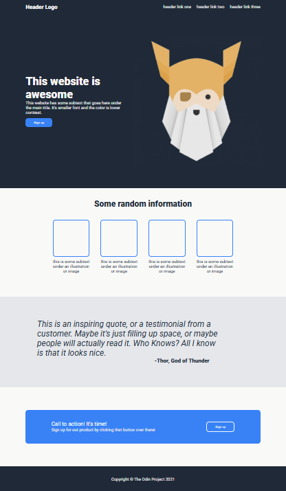

# Project: Landing Page

Leverage `HTML` and `CSS` to create an webpage from a provided design

- Built based on the assignment instructions from the **Flex** section of the **Foundation Course**
at [TheOdinProject](https://www.theodinproject.com).

---

## Assignment

The full design is available [here &rArr;](https://cdn.statically.io/gh/TheOdinProject/curriculum/81a5d553f4073e593d23a6ab00d50eef8620796d/foundations/html_css/project/imgs/01.png).

And, details for the fonts and colours are available [here &rArr;](https://cdn.statically.io/gh/TheOdinProject/curriculum/81a5d553f4073e593d23a6ab00d50eef8620796d/foundations/html_css/project/imgs/02.png)

Use the information provided to create and style a landing page that meets the brief using the skills learned thus far.

## Result

<table>
<tr>
<td>

</td>
<td>

For a full live preview of the finished landing page [click here &rArr;](https://OdinProjectAssignmentsByPW80.github.io/flex_project-landing-page/)

</td
</tr>
</table>

## Review

Initially I tried to go section by section. It was entirely possible; I was making relatively good progress; but, the
css file was an absolute mess.

I decided to try and cultivate good habits early. And, went back to square one. I took some time to dissect the starter
image looking for common and repeated properties. These mostly applied to typography and colour.

This was time consuming. In the end probably about as long as coding and styling the final site. And, for a project this
small, it is hard to justify the temporal investment.

However, if there where more pages - the three in the links and the 'sign up' button for example - unless there styling
varied wildly from the landing page, it is likely they would be able to leverage the same style information.

In addition, this methodology helps to enforce stylistic consistency by re-using rather than re-typing repeated styles.

A better annotated design would have paid dividends - if I am ever responsible for this aspect of the process I will do
well to remember this. Or, when a design does not include detailed information, I should aim for more flexibility rather
than the strictest possible adherence.

Overall, a good practice of taught content and a good learning experience for the things that can't be taught.
